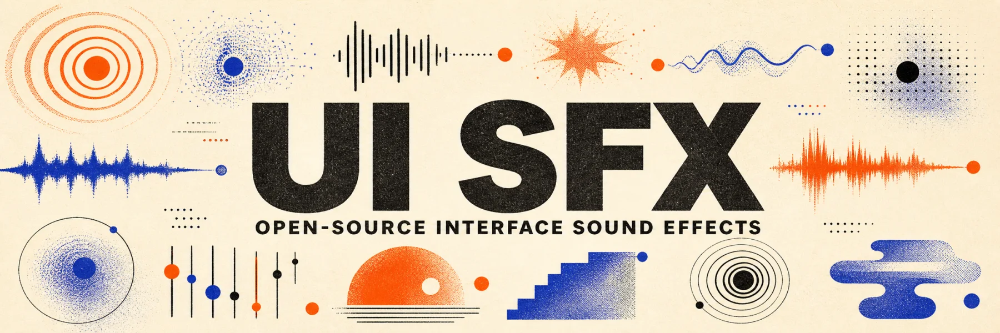

<p align="center">
  
</p>

<p align="center">
  <a href="https://uisfx.com"></a>
  <a href="https://www.npmjs.com/package/uisfx"></a>
  <a href="LICENSE"></a>
  <a href="LICENSE-AUDIO"></a>
  
</p>

# [UI SFX](https://uisfx.com)

Open-source interface sound effects for every product state.

UI SFX is a tiny semantic sound system for web apps, mobile apps, SaaS, education, media, and games. Call `success`, `drop`, or `level-up` once, then switch the whole product between eleven coherent sonic personalities without changing interaction code.

[Preview every sound, cue, and sonic personality at uisfx.com →](https://uisfx.com)

- 78 semantic cues across 13 interaction categories
- 11 complete sound packs
- 858 original sounds in both MP3 and Ogg
- 72 brief one-shots and 6 seamless state loops
- 4.33 MB for every MP3 or 1.86 MB for every Ogg
- 8.9 kB compressed Web Audio runtime with zero dependencies
- MIT code, CC0 audio, and CC0 category art

## Install

```bash
npm install uisfx
```

```ts
import { createUISFX } from 'uisfx'

const ui = createUISFX({ pack: 'minimal' })

saveButton.addEventListener('click', () => {
  ui.play('success')
})

// Loops continue until their interface state resolves.
const processing = ui.play('processing')
processing?.stop()

// Change personality without changing product logic.
ui.setPack('arcade')
```

UI SFX creates its `AudioContext` after the first interaction, synthesizes from the same recipes as the portable library, and caches rendered buffers. It fetches no audio files at runtime.

## Eleven sonic personalities

| Pack | Character | Good fit |
| --- | --- | --- |
| `minimal` | Dry, precise, almost invisible | Productivity, SaaS, system UI |
| `soft` | Rounded, warm, reassuring | Mobile, wellness, friendly SaaS |
| `glass` | Bright, crystalline, premium | Media, finance, luxury products |
| `arcade` | Chunky pixels and cheerful voltage | Games, streaks, gamified learning |
| `mechanical` | Switches, relays, firm detents | Devtools, hardware, industrial UI |
| `organic` | Wood, water, breath, small stones | Education, kids, calm games |
| `dreamy` | Airy blooms and slow sparkle | Creative tools, wellness, ambient apps |
| `scifi` | Holographic scans and data chirps | AI tools, spatial UI, futuristic games |
| `rubber` | Elastic pops and friendly squish | Kids, playful mobile, casual games |
| `cinematic` | Deep impacts and polished tails | Premium media and dramatic moments |
| `studio` | Tactile editing precision with warm restraint | Film, audio, and AI creative tools |

Every pack implements every cue. The complete semantic contract lives in [the taxonomy](docs/taxonomy.md).

## One-shots and loops

Use one-shots for discrete outcomes such as a selection, drop, purchase, success, warning, or error. UI SFX ships 72 of them, each short enough to preserve momentum.

Use loops for visible ongoing states. The six loop cues are `loading`, `processing`, `recording`, `connecting`, `scanning`, and `streaming`. Stop them as soon as the state succeeds, fails, or is cancelled.

```ts
const recording = ui.play('recording')

stopButton.addEventListener('click', () => {
  recording?.stop()
  ui.play('complete')
})
```

## HTML bindings

```ts
import { bindUISFX } from 'uisfx'

const { player, unbind } = bindUISFX()
```

```html
<a data-uisfx-hover="hover">Documentation</a>
<button data-uisfx-press="press" data-uisfx-release="release">Hold me</button>
<button data-uisfx="success" data-uisfx-pack="soft">Save</button>
```

Call `unbind()` when a client-rendered view is destroyed.

## Portable audio files

The package includes `sounds/{pack}/{cue}.mp3` and `sounds/{pack}/{cue}.ogg` for React Native, Swift, Kotlin, Unity, Godot, video, and any environment without Web Audio.

```ts
import successUrl from 'uisfx/sounds/soft/success.mp3?url'

const success = new Audio(successUrl)
await success.play()
```

The `uisfx/manifest` export describes each exact path, byte size, duration, loop flag, default volume, cue, category, and pack.

## Accessibility

Sound should reinforce visible feedback, never replace it.

- Give people a persistent mute setting and respect their device volume.
- Never make audio the only distinction between success, warning, and error.
- Keep hover feedback quiet or disable it in dense interfaces.
- Start audio only after an explicit interaction.
- Debounce high-frequency notifications and stop loops with their visible state.

```ts
ui.setEnabled(false)
ui.setVolume(0.5)
ui.stopAll()
```

## Build from source

The checked-in sound files are reproducible from deterministic synthesis recipes.

```bash
npm install
npm run generate
npm run check
```

Node 22.20 or later and `ffmpeg` are required. The full quality gate regenerates every file, typechecks, tests, builds the package and showcase, and validates audio size, peaks, silence, and asset counts.

## Why semantic cues?

Names such as `soft-pop-03.mp3` make every product invent its own meaning. UI SFX separates intent from timbre:

```text
product event  ->  semantic cue  ->  sound pack  ->  recipe or asset
upload done        complete          glass           complete.ogg
lesson done        complete          arcade          complete.ogg
```

The product event stays stable while the sound system evolves independently.

## Contributing

Issues and focused pull requests are welcome. Read [CONTRIBUTING.md](CONTRIBUTING.md) before changing the taxonomy or synthesis recipes; a new cue must work in all eleven packs and keep a visible or haptic counterpart.

## License

The TypeScript code is [MIT licensed](LICENSE). The procedurally generated audio library is dedicated to the public domain under [CC0 1.0](LICENSE-AUDIO), as are the [category illustrations](LICENSE-ART).
